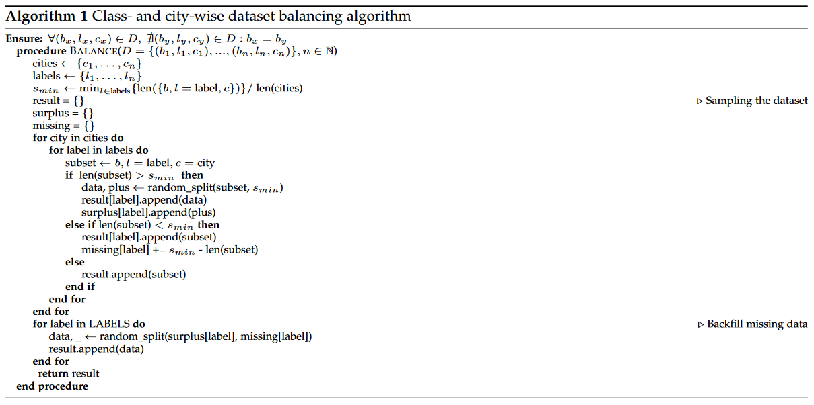
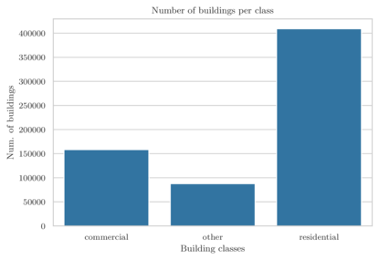
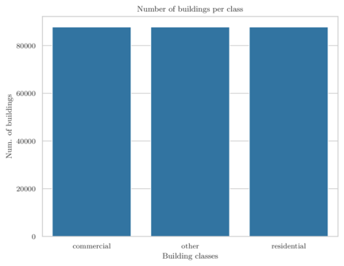
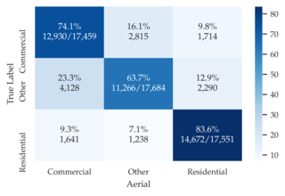
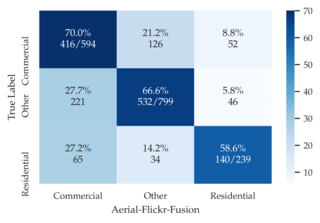
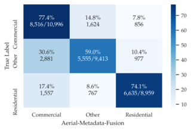
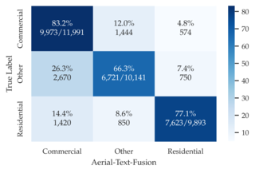
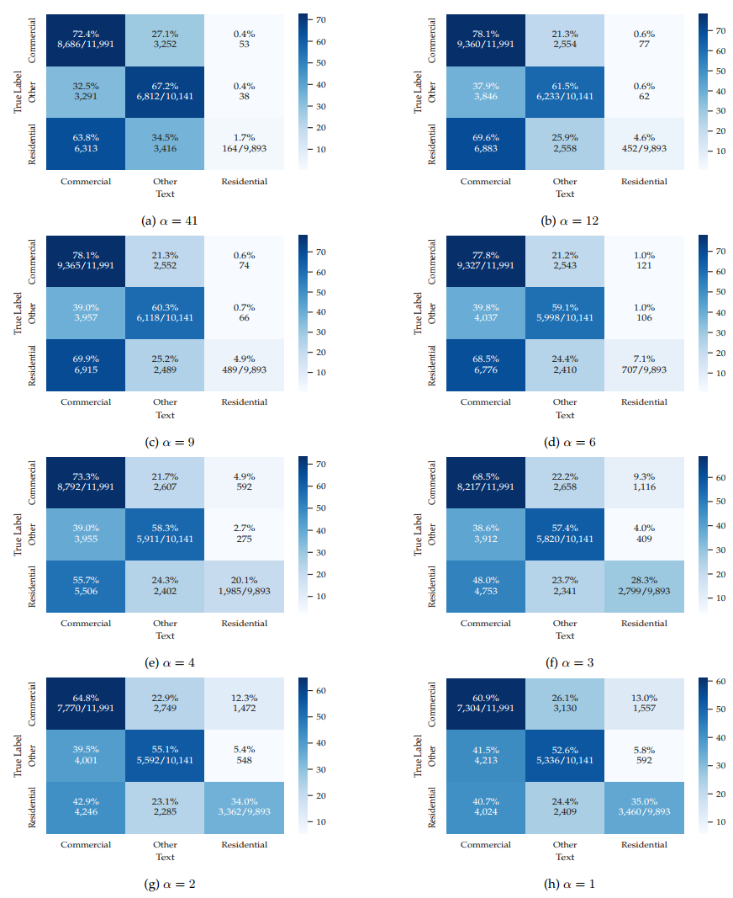

# So2Sat-BuildingType
A large-scale dataset for building type classification using social media and aerial data

## Dataset

### Balancing

In this section the balancing algorithm discussed in section 5.1 in our paper is shown with greater detail.



The two figures below depict the distribution of the labeled buildings before (left) and after (right) balancing, where the balancing algorithm down-sample the *residential* and *commercial* classes to meet the number of buildings in the *other* class.





### Download

The dataset is split into two parts with different licenses
1. Building data and metadata feature vectors are available at [https://mediatum.ub.tum.de/1662350](https://mediatum.ub.tum.de/1662350)
2. Twitter tweet IDs and Flickr image urls are available at [https://mediatum.ub.tum.de/1662351](https://mediatum.ub.tum.de/1662351)

### Details

- All labeled buildings (`buildings.csv.bz2`) are in part I. It contains information about the 6,950,182 OSM labeled buildings that we are able to identify in the 42 cities. For each building, we share: `osm_building_id`, `class`, `city`, and `geometry` (polygon or multi-polygons coordinates). The geometry column includes WKT strings which contain comas but enclosed with double quotes. When reading the csv with Python libraries such as pandas, it is possible to specify the quote char to circumvent a wrongly imported file. It is possible due to the adjacency of some urban areas that buildings are assigned to multiple places. Please filter according to your task/area specifications.
- Twitter dataset for text classification (`tweets.csv.bz2`) is in part II. It contains the list of 26,666,198 geo-tagged tweets that are collected in the 42 cities and that are assigned to a labeled building. For each tweet, we share: `tweet_id`, `osm_building_id`, `building_class`, `building_city`, `tweet_lang`, `distance_to_building` (in meter), `tweet_creation_time` (in UTC), `tweet_longitude`, and `tweet_latitude`.
- Google aerial images dataset. We do not provide a data file, but we provide the script that we used to download the aerial images from Google in the code repository.
- Flickr images dataset (`flickr.csv.bz2`) is in part II. It contains the list of 26,381 filtered Flickr images that are collected in the 42 cities and that are assigned to a labeled building. For each Flickr image, we share: `image_url`, `image_city`, `building_id`, `building_class`, `distance_to_building (in meter).
- Twitter metadata vectors for the buildings that have more than 5 tweets (`metadata.csv.bz2`) are in part I. It contains the metadata features of the 385,764 buildings that have more than 5 tweets assigned. For each metadata vector, we share: `building_id`, `building_class`, `building_city`, `lng` building centroid longitude, `lat` building centroid latitude, and a list of the 181 feature values.


## Code

- ``download_building_aerial_images.py`` yields the corresponding aerial images for each building
- ``undersample.py`` performs two-dimensional undersampling as described in the paper
- ``split_train_test.py`` splits the imbalanced and balanced buildings.csv.bz2 into a training and test part

## Appendix of the paper
In this section we provide subsequent statistics and baseline results achieved with our proposed dataset.

### Additional Dataset Statistics

#### Twitter
In this subsection we provide additional information about the Twitter modality. The table below shows the word count under
consideration of the α value.

| $\alpha$   | Number of unique words |
| :--------: | -----------------:     |
| 41         | 36,058                 |
| 12         | 24,151                 |
| 9          | 21,519                 | 
| 6          | 18,006                 | 
| 4          | 14,647                 |
| 3          | 12,741                 |
| 2          | 10,429                 |
| 1          | 6,978                  |

*Number of unique words in the textual corpus for each value of α, where α refers to the maximum number of
tweets to consider per building*

The next table gives statistics about the distribution of tweets per building.

|              | min   | max       | median | mean   | variance   | sd      |
| :--------    | :---: | :---:     | :---:  | :---:  |  :---:     | :---:   |
| Commercial   |  1    | 584,296   |  4     | 66.99  | 4,975,237  | 2230.52 |
| Residential  |  1    | 134,995   |  1     | 10.57  | 81,421.64  | 285.34  |
| Other        |  1    | 1,541,532 |  4     | 133.49 | 39,229,660 | 6263.36 | 
| All          |  1    | 1,541,532 |  2     | 40.69  | 6,513,908  | 2552.24 | 

*The minimum, maximum, median, mean average, variance, and standard deviation for the number of tweets per
building. “All” refers to all buildings of all classes*

| Data share (#buildings)      | min   | max       | median    | mean       | variance   | sd      |
| :--------                    | :---: | :---:     | :---:     | :---:      |  :---:     | :---:   |
| 0% (655,425)                 | 1     | 1,541,532 | 2         | 40.69 (41) | 6,513,908  | 2552.24 |
| 1% (642,316)                 | 1     | 426       | 2         | 11.95 (12) | 1377.23    | 37.11   |
| 2% (629,208)                 | 1     | 207       | 2         | 9.14 (9)   | 535.29     | 23.14   |
| 5% (589,882)                 | 1     | 71        | 2         | 5.77 (6)   | 113.76     | 10.67   |
| 10% (524,340)                | 1     | 27        | 2         | 3.72 (4)   | 24.45      | 4.94    |
| 15% (458,798)                | 1     | 14        | 2         | 2.79 (3)   | 7.93       | 2.82    | 
| 20% (393,255)                | 1     | 8         | 2         | 2.27 (2)   | 3.13       | 1.77    |
| 25% (327,712)                | 1     | 5         | 2         | 1.94 (1)   | 1.40       | 1.18    |

*The minimum, maximum, median, mean average, variance, and standard deviation for the number of tweets per
building. In the last case, we put* α *= 1 instead of 2 to differentiate it from the previous case.*


#### Flickr
The following table documents the single steps of the Flickr Filtering pipeline.

| Filtering Step                                 | #Images    | Share of whole dataset |
|:---------                                      |  :----:    | --------------:        |
| Flickr images for 42 cities                    | 28,818,438 | 100.00%                |
| Step 1: similarity filter                      | 1,635,592  | 5.67%                  |
| Step 2: object detection filter                | 891,861    | 3.09%                  |
| Step 3: automatic location tag                 | 457,669    | 1.59%                  |
| Step 4: GPS direction available                | 88,593     | 0.31%                  |
| Step 5: Labeled OSM building in line-of-sight  | 26,381     | 0.09%                  |

*Number of Flickr images after each filtering step*


### Baseline Results

The following sections document building function classification
baseline results generated with the introduced dataset. First, we
separately present classification baselines for each data modality,
namely text, aerial images, Flickr images, and metadata based
classification. Then, the modalities are fused at the decision level.
Note that the baselines concern the balanced version of the dataset,
where each class has the same number of buildings. Also, when necessary the dataset is divided
80/20 to generate training and testing subsets. So, we never have the
case that the model is trained and tested on the same data.

### Text-Based Building Classification Using TF-IDF and Naïve Bayes

In this section we present building function classification baseline
results based on monolingual tweets (English tweets text). To classify a
building, we first classify its tweets. Then, the final building label
is identified by aggregating the classification output of the tweets
that are assigned to it. More precisely, we average the tweets
classification output class-wise, and then the class of the building is
the class that has the highest average value.

The classification was conducted using TF-IDF features which have been
fed into a multinomial Naïve Bayes classifier. Before the
classification, the tweets' texts have been cleaned applying standard
natural language processing methods, namely all letters have been
lower-cased and URLs, mentions, and numbers have been removed as well.
Additionally, stop-words have been removed to lower the complexity of
the classification and to reduce the vocabulary size. The last
preprocessing step comprised the removal of all words shorter than two
characters. Furthermore, we only keep the words that occur in more than
5 tweets and less than 90% of tweets.

Table 1 shows the overall classification
results achieved by the Naïve Bayes classifier. The overall accuracy
ranges from $0.49$ to $0.53$ and the Kappa score from $0.214$ to
$0.275$. It can be seen that considering more tweets per building
(larger $\alpha$) does not always lead to better overall classification
results. Instead, datasets with a relatively small $\alpha$ value, e.g.
$\alpha = 3$, can outperform the largest dataset, e.g. $\alpha = 41$.

| $\alpha$ | Overall  Accuracy | $\kappa$  | Precision | Recall   | F1       |
| :--------: | :-----------------: | --------- | :---------: | :--------: | :--------: |
| 41       | 0.49              | 0.214     | 0.54      | 0.47     | 0.40     |
| 12       | 0.50              | 0.229     | 0.59      | 0.48     | 0.42     |
| 9        | 0.50              | 0.225     | **0.60**  | 0.48     | 0.42     |
| 6        | 0.50              | 0.228     | 0.59      | 0.48     | 0.43     |
| 4        | 0.52              | 0.264     | 0.57      | **0.51** | 0.49     |
| 3        | **0.53**          | **0.275** | 0.56      | **0.51** | **0.51** |
| 2        | 0.52              | 0.271     | 0.55      | **0.51** | **0.51** |
| 1        | 0.50              | 0.243     | 0.53      | 0.50     | 0.50     |

*Table 1: Building-wise overall text-based classification results of monolingual text (only English tweets).* $\kappa$ *= Cohen's Kappa.*

Table 2 shows the class-wise results. It
can be noticed that over-represented classes, i.e. commercial and other,
achieve higher scores with larger datasets, i.e., larger $\alpha$
values. In contrast, the under-represented residential class (see figure
[\[fig:class_dist_for_tweets_and_buildings\]](#fig:class_dist_for_tweets_and_buildings){reference-type="ref"
reference="fig:class_dist_for_tweets_and_buildings"}) yields higher
scores when the datasets get less skewed. This trend is observable when
the $\alpha$ value is decreasing. Recall and F1 scores are increasing
for the residential class when $\alpha$ decreases. Figure
[\[fig:text_cm\]](#fig:text_cm){reference-type="ref"
reference="fig:text_cm"} presents the confusion matrices of the
text-based classifier. It shows that whatever the value of $\alpha$ is,
the commercial class is the easiest class to predict, and the other
class is the second easiest class. However, residential is the hardest
class. This is partially due to the fact that most of the residential
buildings have only one assigned tweet. Therefore, it is hard for the
classifier to identify a clear pattern. It could also be due to the fact
that people tend to tweet about so many diverse topics when they tweet
from home. In addition, Figure
[\[fig:text_cm\]](#fig:text_cm){reference-type="ref"
reference="fig:text_cm"} shows that the classifier is highly confused
about the residential tweets, and most probably it classes them as
commercial. The main cause of this behaviour is the mixed-use buildings.

|          |          | *commercial*   |          |          | *other*  |          |          | *residential* |          |
| :---:      | ---      | :------------: | :---:      | :---:      | :--------: | :---:      | :---:     | :---:           | :---:      |
| $\alpha$ | P        | R              | F1       | P        | R        | F1       | P        | R             | F1       |
| 41       | 0.47     | 0.72           | 0.57     | 0.51     | **0.67** | **0.58** | 0.64     | 0.02          | 0.03     |
| 12       | 0.47     | **0.78**       | **0.58** | **0.55** | 0.61     | **0.58** | 0.76     | 0.05          | 0.09     |
| 9        | 0.46     | **0.78**       | **0.58** | **0.55** | 0.60     | 0.57     | **0.78** | 0.05          | 0.09     |
| 6        | 0.46     | **0.78**       | **0.58** | **0.55** | 0.59     | 0.57     | 0.76     | 0.07          | 0.13     |
| 4        | 0.48     | 0.73           | 0.58     | 0.54     | 0.58     | 0.56     | 0.70     | 0.20          | 0.31     |
| 3        | **0.49** | 0.69           | 0.57     | 0.54     | 0.57     | 0.56     | 0.65     | 0.28          | 0.39     |
| 2        | **0.49** | 0.65           | 0.55     | 0.53     | 0.55     | 0.54     | 0.62     | 0.34          | 0.44     |
| 1        | 0.47     | 0.61           | 0.53     | 0.49     | 0.53     | 0.51     | 0.62     | **0.35**      | **0.45** |

*Table 2: Class-wise text classification results. P=Precision, R=Recall, F1=F1 score. The results are presented building-wise.*

### Aerial Images Based Building Classification

We use the balanced version of the dataset to fine-tune a VGG16
architecture with ImageNet weights. For fine-tuning we apply a two step
approach as in [Hoffmann et al. 2019](https://www.mdpi.com/2072-4292/11/11/1259). First, we add a new `softmax` layer for
classification and train only this layer with a learning rate of $0.0001$
for 16 epochs. Afterward, we restore the weights that gained the lowest
validation loss during all epochs and continue training to adjust all
layers to the aerial imagery. In this second step, we decrease the
learning rate to $0.00004$, train again for 16 epochs, and restore the
weights yielding the lowest validation loss. These weights are defined
to be the final model. Table [3](#tab:modalities){reference-type="ref"
reference="tab:modalities"} ("Aerial" column) shows the classification
performance based on very high-resolution Google aerial images. Figure
[13](#fig:aerial_cm){reference-type="ref" reference="fig:aerial_cm"}
shows the confusion matrix of the classifier. 

|                  |         | Aerial   |        |         | Flickr   |        |         | Metadata   |        |
| :--------        | :-----: | :------: | :----: | :-----: | :------: | :----: | :-----: | :--------: | :----: |
|                  | P       | R        | F1     | P       | R        | F1     | P       | R          | F1     |
| commercial       | 0.73    | 0.78     | 0.75   | 0.45    | 0.53     | 0.48   | 0.52    | 0.62       | 0.56   |
| other            | 0.74    | 0.62     | 0.67   | 0.34    | 0.59     | 0.43   | 0.49    | 0.46       | 0.47   |
| residential      | 0.79    | 0.84     | 0.81   | 0.63    | 0.23     | 0.33   | 0.59    | 0.48       | 0.53   |
| Overall Accuracy | 0.75    |          |        | 0.42    |          |        | 0.53    |            |        |
| $\kappa$         | 0.622   |          |        | 0.166   |          |        | 0.284   |            |        |

*Table 3: Building-wise classification results based on Google aerial images, Flickr images, and tweets metadata. P=Precision, R=Recall, F1=F1 score, OA=Overall Accuracy, and* $\kappa$*=Cohen's Kappa.*

### Flickr Images Based Building Classification

We classify Flickr images using a fine-tuned model as described above in
Section [1.2](#sec:results:aerial_imagery){reference-type="ref"
reference="sec:results:aerial_imagery"}. However, instead of Google
aerial images, the model is trained using a global sample of Google
Street View data [(Hoffmann et al. 2023)](https://www.sciencedirect.com/science/article/pii/S0264275122005467). Table
[3](#tab:modalities){reference-type="ref" reference="tab:modalities"}
("Flickr" column) shows the classification performance based on Flickr
images. Figure [14](#fig:flickr_cm){reference-type="ref"
reference="fig:flickr_cm"} shows the confusion matrix of the classifier.
Note that to classify a building with many Flickr images assigned, we
first classify its Flickr images. Then, the final building label is
identified by aggregating the classification output of the Flickr images
that are assigned to it. More precisely, we average the Flickr images
classification output class-wise, and then the class of the building is
the class that has the highest average value.

### Metadata Vectors Based Building Classification

The metadata features concatenate different types of data in one vector.
Because of this heterogeneity, we choose a gradient boosted tree
algorithm, XGBoost, to predict the building functions. For this baseline
model, we use a learning rate of $0.1$ and a maximum of 4096 trees with at
most 11 levels. To ensure comparability across the results, the model
was trained on the balanced version of the dataset. Table
[3](#tab:modalities){reference-type="ref" reference="tab:modalities"}
("Metadata" column) shows the classification performance based on tweets
metadata features. Figure [15](#fig:metadata_cm){reference-type="ref"
reference="fig:metadata_cm"} shows the confusion matrix of the
classifier.

### Fusion

Data fusion of two different modalities is a challenging task
[(Schmitt & Zhu 2016)](https://ieeexplore.ieee.org/document/7740215). Especially when the two modalities are
fundamentally different such as social media and remote sensing data
[(Ghamisi et al. 2019)](https://ieeexplore.ieee.org/abstract/document/8672156). Hoffmann et al. [(Hoffmann et al. 2019)](https://www.mdpi.com/2072-4292/11/11/1259) and [(Machado at al. 2020)](https://ieeexplore.ieee.org/document/9238485) show that the fusion of remote sensing and social media
data/ground level images achieves good results when a decision fusion
method is utilized. Therefore, the fusion of the social media and the
remote sensing data is performed by a straightforward decision fusion
method. It follows the decision-in-decision-out principle
[(Dasarathy 1997)](https://ieeexplore.ieee.org/document/554206) by averaging the softmax probability vectors of the
social media and remote sensing image classification. A significant
advantage of this fusion method is that one sensor source, e.g., social
media, can back up the remote sensor if an image of a specific building
is not available or is covered with clouds [(Dasarathy 1997)](https://ieeexplore.ieee.org/document/554206). A possible
disadvantage is that results can cancel each other out. The following
sections give an overview of the fusion results of the different
modalities with remote sensing images.

### Aerial Results

The aerial baseline model yields an overall accuracy of $0.75$ (see Table
[4](#tab:fusion){reference-type="ref" reference="tab:fusion"}, "Aerial"
column). It is particularity strong on residential buildings with an F1
score of $0.81$. Commercial buildings are in between, while other
buildings show the lowest F1 score of $0.67$. A possible hypothesis for
this behavior is that especially single detached houses have green
gardens around, which is a clear pattern. Other buildings can be
landmark buildings or touristic hot spots, which are also clearly
visible for a nadir view. However, if it comes to schools, universities,
or hospitals, their roofs are very similar to commercial buildings,
which might be an explanation why the performance for these two classes
is lower. Below you can find the confusion matrix of the
classifier.



### Flickr Fusion Results

Social media images as a stand alone modality show mixed results (see
Table [4](#tab:fusion){reference-type="ref" reference="tab:fusion"},
"Flickr" column). Commercial buildings are predicted best with a F1
score of $0.48$. Second, there are other buildings with a F1 score of $0.43$
and finally, residential with $0.34$ F1 score. This last result is close
to a random classifier. However, in combination with aerial images it
improves the results for the other class from $0.67$ (aerial alone) to
$0.71$ (aerial + Flickr), which is the best value for this class among all
modalities. As a drawback, the fusion decreases the classification
performance for commercial and residential by $0.11$ and $0.22$ with respect
to their performance using aerial images alone. However, the fusion
performance is always better than the performance when using Flickr
images alone. Figure
[2](#fig:aerial_flickr_fusion_cm){reference-type="ref"
reference="fig:aerial_flickr_fusion_cm"} shows the confusion matrix of
the fusion classifier.



Visual analysis of the Flickr images show that just a few of them have
one clear building in the image center. Most images show a street
perspective that contains multiple buildings with different functions.
In such cases, a CNN predicts an equally distributed softmax output, but
the final argmax does not take this into account. Additionally, a human
validation of the labels showed that even if there is just one building
depicted in an image, it can serve multiple functions on different
floors. For example, in dense urban areas there are shops or restaurants
on the ground floor, an office on the first floor, and all other floors
have apartments.

### Metadata Fusion Results

The performance of the metadata classifier is on par with the text
classifier. It yields an overall accuracy of $0.53$, but has different
strengths w.r.t. the text classifier (see Table
[4](#tab:fusion){reference-type="ref" reference="tab:fusion"}). It is
equally good for commercial and residential buildings with F1 scores of
$0.56$ and $0.53$. The gradient boosted tree model shows the worst result
for other buildings ($0.48$ F1 score). However, none of these predictions
improves the aerial image classifier in the fusion experiment. All
metrics become worse compared to aerial only results indicating that
both modalities are not complementary, but share the same weaknesses.
However, the fusion performance is always better than the performance
when using metadata alone. Figure
[3](#fig:aerial_metadata_cm){reference-type="ref"
reference="fig:aerial_metadata_cm"} shows the confusion matrix of the
fusion classifier.



### Text Fusion Results

The text fusion results documented in Table
[4](#tab:fusion){reference-type="ref" reference="tab:fusion"} show
promising results. Even the modest Naïve Bayes baseline can improve the
remote sensing image classification results. The commercial and other
classes benefit from fusion, which is reflected by increased F1 scores.
The reason could be that commercial and other structures share visual
features [(Cheng et al. 2018)](https://ieeexplore.ieee.org/document/8252784) and [(Albert et al. 2017)](http://doi.acm.org/10.1145/3097983.3098070). Here, the in situ sensors could add
additional information and hence lift the classification results. In
contrast, the residential class cannot gain any performance boost--yet
the scores are not decreasing. A possible explanation could be that the
strong remote sensing classification results for the residential class
do not need additional ground data. In the case of fusing text and
remote sensing data, the features of the two modalities seem to be
complementary. Figure [4](#fig:aerial_text_cm){reference-type="ref"
reference="fig:aerial_text_cm"} shows the confusion matrix of the fusion
classifier.



|                  | Aerial (VHR)   | Flickr   |          | Metadata   |          | Text    |          |
| :--------        | :------: | :------: | :------: | :--------: | :------: | :-----: | :------: |
|                  |          |          | Fusion   |            | Fusion   |         | Fusion   |
| commercial       | 0.75     | 0.48     | 0.64     | 0.56       | 0.71     | 0.57    | 0.77     |
| other            | 0.67     | 0.43     | 0.71     | 0.48       | 0.64     | 0.56    | 0.70     |
| residential      | 0.81     | 0.34     | 0.59     | 0.53       | 0.76     | 0.39    | 0.81     |
| Overall Accuracy | 0.75     | 0.42     | 0.67     | 0.53       | 0.71     | 0.53    | 0.76     |
| $\kappa$         | 0.622    | 0.166    | 0.458    | 0.284      | 0.553    | 0.275   | 0.635    |

*Table 4: Building-wise fusion results. VHR=Very high-resolution images (Google aerial images). The text results refer to the results achieved for* $\alpha$*=3. All results are building-wise and represented by F1 score.*

#### Confusion Matrices with respect to $\alpha$ 

Confusion matrices of **text** based classifiers according to α values:




## Citation

Available at _TBA_

BibTeX:
```commandline
insert_paper_bibtex_here
```
